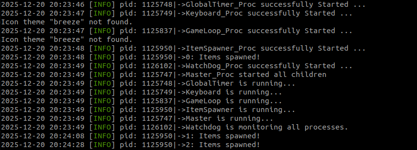
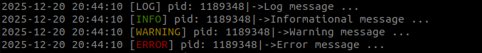

# drone-simulation

## Overview

This project is an interactive drone simulation that operates in a terminal-based environment using `ncurses`. The simulation consists of:

A controllable drone navigating in a bounded area, Randomly appearing obstacles and targets, Repulsion forces following Khatib's model.

It can be used for **simple path-planning** of drones with respect to avoidable regions.


- **Real-time Drone Control**: Users can move the drone using keyboard input.
- **Speed Adjustment**: Pressing the same movement key or holding it repeatedly increases the drone's force, leading to acceleration.
- **Multi-process Architecture**: A master process forks and runs other processes.
- **Shared Memory & IPC**: Uses shared memory structs for inter-process communication and pipes for reading keyboard data.
- **Network Communication:** Uses TCP sockets for reliable client-server communication, sending and receiving drone and obstacle positions in real time.


```
              ┌─────────────────────┐
              │     Shared Memory   │
              │   (BlackBoard items)│
              │---------------------│
              │  ItemData[0..MAX]   │
              │  (Drone / Target /  │
              │   Obstacle info)    │
              └─────────▲───────────┘
                        │
       ┌────────────────┴─────────────────┐  
       │                                  │
       │     Each process wraps these     │
       │     shared ItemData in local     │
       │     logic objects (ItemLogic)    │
       │                                  │ 
   Process 1                          Process 2
 ┌─────────────┐                    ┌─────────────┐
 │ Logic Pool  │                    │ Logic Pool  │
 │ (ItemLogic*)│                    │ (ItemLogic*)│
 │ ┌─────────┐ │                    │ ┌─────────┐ │
 │ │ Drones  │ │                    │ │ Drones  │ │
 │ ├─────────┤ │                    │ ├─────────┤ │
 │ │ Targets │ │                    │ │ Targets │ │
 │ ├─────────┤ │                    │ ├─────────┤ │
 │ │Obstacles│ │                    │ │Obstacles│ │
 │ └─────────┘ │                    │ └─────────┘ │
 └───────┬─────┘                    └───────┬─────┘
         │                                  │
         └─────────── accesses ─────────────┘
                  Shared ItemData
```

How it works:

1. Shared Memory (BlackBoard items)
   - Holds the canonical data (ItemData) for all drones, targets, and obstacles.
   - Accessible by all processes.

2. Logic Pool (per process)
   - Holds local ItemLogic* objects that wrap the shared ItemData.
   - Enables process-specific behavior and computations (physics, AI, etc.).
   - Reuses slots efficiently using the pool mechanism.

3. Pipes / Events
   - Allow sending commands (keyboard input, triggers) between processes.
   - Processes act on shared ItemData and update their logic objects.

## Project Structure
```
.
├── CMakeLists.txt
├── images
│   ├── Formulas.png
│   ├── LogLevels.png
│   ├── LogPic.png
│   └── snap_shot.png
├── include
│   ├── communication
│   │   ├── BlackBoard.h
│   │   ├── Communication.h
│   │   ├── NetworkSocket.h
│   │   ├── Pipe.h
│   │   └── SharedMemoryData.h
│   ├── config.h
│   ├── input_devices
│   │   └── Keyboard.h
│   ├── item_data
│   │   └── ItemData.h
│   ├── item_logic
│   │   ├── DroneLogic.h
│   │   ├── ItemLogic.h
│   │   ├── ObstacleLogic.h
│   │   ├── PhysicsBody.h
│   │   ├── Space2DLogic.h
│   │   └── TargetLogic.h
│   ├── logger
│   │   └── Logger.h
│   └── windowing
│       └── Ncurses_Win.h
├── README.md
└── src
    ├── communication
    │   ├── BlackBoard.cpp
    │   ├── Communication.cpp
    │   ├── NetworkSocket.cpp
    │   ├── Pipe.cpp
    │   └── SharedMemoryData.cpp
    ├── input_devices
    │   └── Keyboard.cpp
    ├── item_data
    │   └── ItemData.cpp
    ├── item_logic
    │   ├── DroneLogic.cpp
    │   ├── ItemLogic.cpp
    │   ├── ObstacleLogic.cpp
    │   ├── PhysicsBody.cpp
    │   ├── Space2DLogic.cpp
    │   └── TargetLogic.cpp
    ├── logger
    │   └── Logger.cpp
    ├── Proc
    │   ├── GameLoop_Proc.cpp
    │   ├── GlobalTimer_Proc.cpp
    │   ├── ItemSpawner_Proc.cpp
    │   ├── KeyBoard_Proc.cpp
    │   ├── Master_Proc.cpp
    │   ├── NetworkGate_Proc.cpp
    │   ├── Temp_Proc.cpp
    │   └── WatchDog_Proc.cpp
    └── windowing
        └── Ncurses_Win.cpp


``` 

## Simulation Dynamics


The drone operates with two degrees of freedom and follows the equation of motion:

F = M d²p/dt² + K dp/dt

Where:
- **p** = drone position
- **F** = sum of forces (control, repulsion, attraction)
- **M** = mass 
- **K** = viscous coefficient (N·s·m)

#### Khatib's Model for Obstacle Repulsion
The repulsive force (F_r) from an obstacle at distance (d) is defined as:

F_rep =
    η (1/ρ - 1/ρ₀) (1/ρ²) d,  if ρ ≤ ρ₀, 
    0,                     if ρ > ρ₀

where:
- η (Eta) is the gain factor
- d is the influence radius

## Log Messages Overview
Log messages can be viewed both in the terminal and in a log file. If you need more detailed information, 
such as heartbeats from the watchdog or other related data, you can find it in the system_wide.log file located in the processes folder.



#### Log Levels
There are four different log levels:




## Network Communication Overview

**Notes:**
- All positions are optionally **flipped** to match server/client views.
- Positions are **scaled** to the local play area window size.
- The drone/obstacle update loop continues until a shutdown signal is received.

#### Sequence Diagram (Mermaid)

```
sequenceDiagram
    participant S as Server
    participant C as Client

    %% Phase 1: Handshake
    Note over S,C: 🟦 Handshake phase
    C->>S: TCP connect
    S-->>C: "ok"
    C-->>S: "ook"

    %% Phase 2: Window Setup
    Note over S,C: 🟨 Window dimensions setup
    S-->>C: "size WIDTH,HEIGHT"
    C-->>S: "sok"

    %% Phase 3: Game Loop
    Note over S,C: 🟩 Game loop (runs until shutdown)
    loop Game Loop
        alt Normal iteration
            S-->>C: "drone"
            S-->>C: server_drone_position
            C-->>S: "dok"

            S-->>C: "obst"
            C-->>S: client_drone_position
            S-->>C: "pok"
        else Shutdown triggered
            Note over S,C: 🟥 Shutdown sequence
            S-->>C: "q"
            C-->>S: "qok"
        end
    end

````

## How to Build and Run
#### Dependencies
- `Konsole` for terminal 
- `Ncurses` for terminal visualization
- `tail`    for live monitoring 

**Follow these steps to build the project:**

1. Clone the code using `git`

2. Open a terminal and navigate to the project folder.

3. Run the following commands:

```bash
mkdir build
cd build
cmake ..
make -j
```

**To execute the project, perform the following steps:**

```bash
cd processes
./Master_Proc 
```
---

## Description of Components 
#### Master Process

The Master Process is responsible for launching and managing child processes `(e.g., GlobalTimer, Keyboard, GameLoop, ItemSpawner, Watchdog , NetworkGate)` using `fork() and execlp()`. 
It sets up inter-process communication through pipes, logs the processes' statuses, and sends heartbeat signals to the Watchdog. It monitors the status of child processes 
and ensures proper cleanup and shutdown in case of failure.

#### Watchdog Process

The Watchdog Process monitors the health of child processes by polling for heartbeat signals via pipes and timers. 
If any process fails to send a heartbeat within the timeout period, the Watchdog initiates a shutdown sequence, 
first sending `SIGTERM` and then `SIGKILL` if needed. It logs the status of each process, handles cleanup, 
and ensures all resources are released when shutting down.

#### GlobalTimer Process
Handles the global time for the game. It triggers every 1 millisecond using POSIX timers and updates the shared BlackBoard with the current time. 
It also sends heartbeat signals to ensure the timer is alive.

#### ItemSpawner Process
Responsible for spawning game objects (`Drone (#)`, `Obstacles (O)`, `Targets (*)` ) in the shared memory. 
It uses the BlackBoard to get the play area size and randomly generates positions for the items. It also includes a heartbeat mechanism to signal if the spawner is still active.

#### GameLoop Process
The core of the game where all game objects are updated, physics are applied, and the game is rendered. 
It ensures the game runs at a fixed time step for consistent physics and processes user input. 
It also handles object spawning, updates, and removals based on game logic.

#### Keyboard Process
The Keyboard process captures user input via the keyboard and sends movement commands to the GameLoop (via pipe). It uses ncurses for non-blocking key presses, 
handling movement with keys like WASD, arrow keys, and diagonals (Q, E, Z, C). The X key is used to reset the Force (thrust) to zero, effectively stopping the drone's movement.

#### NetworkGate Process 
The NetworkGate process handles network communication between two game instances. It can run in **Server** or **Client** mode, selectable from the menu.  

- **Server mode:** Accepts a client connection, performs a handshake, continuously sends the server drone’s position, and receives the client drone’s position.  
- **Client mode:** Connects to the server, performs the handshake, receives the server drone’s position, and sends the client drone’s position.

It uses **TCP** for reliable communication, acknowledges received messages, and handles shutdown signals to terminate gracefully.

---