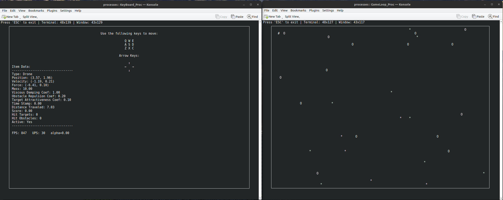
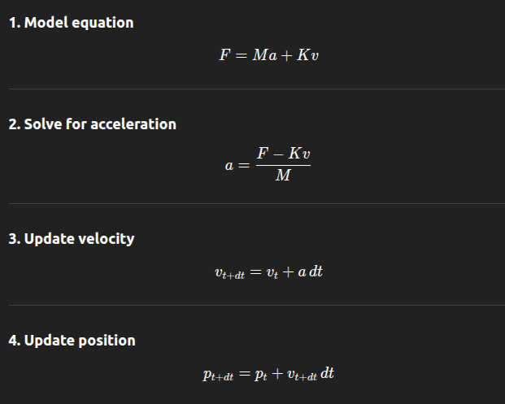

# drone-simulation

## Overview
**>------------ This project is under development ------------<**

This project is an interactive drone simulation that operates in a terminal-based environment using `ncurses`. The simulation consists of:

A controllable drone navigating in a bounded area, Randomly appearing obstacles and targets, Repulsion forces following Khatib's model.

It can be used for **path-planning** of drones with respect to avoidable regions.



- **Real-time Drone Control**: Users can move the drone using keyboard input.
- **Speed Adjustment**: Pressing the same movement key or holding it repeatedly increases the drone's force, leading to acceleration.
- **Multi-process Architecture**: A master process forks and runs other processes.
- **Shared Memory & IPC**: Uses shared memory structs for inter-process communication and pipes for reading keyboard data.


```
              ┌─────────────────────┐
              │     Shared Memory   │
              │   (BlackBoard items)│
              │---------------------│
              │  ItemData[0..MAX]   │
              │  (Drone / Target /  │
              │   Obstacle info)    │
              └─────────▲───────────┘
                        │
       ┌────────────────┴─────────────────┐  
       │                                  │
       │     Each process wraps these     │
       │     shared ItemData in local     │
       │     logic objects (ItemLogic)    │
       │                                  │ 
   Process 1                          Process 2
 ┌─────────────┐                    ┌─────────────┐
 │ Logic Pool  │                    │ Logic Pool  │
 │ (ItemLogic*)│                    │ (ItemLogic*)│
 │ ┌─────────┐ │                    │ ┌─────────┐ │
 │ │ Drones  │ │                    │ │ Drones  │ │
 │ ├─────────┤ │                    │ ├─────────┤ │
 │ │ Targets │ │                    │ │ Targets │ │
 │ ├─────────┤ │                    │ ├─────────┤ │
 │ │Obstacles│ │                    │ │Obstacles│ │
 │ └─────────┘ │                    │ └─────────┘ │
 └───────┬─────┘                    └───────┬─────┘
         │                                  │
         └─────────── accesses ─────────────┘
                  Shared ItemData
```

How it works:

1. Shared Memory (BlackBoard items)
   - Holds the canonical data (ItemData) for all drones, targets, and obstacles.
   - Accessible by all processes.

2. Logic Pool (per process)
   - Holds local ItemLogic* objects that wrap the shared ItemData.
   - Enables process-specific behavior and computations (physics, AI, etc.).
   - Reuses slots efficiently using the pool mechanism.

3. Pipes / Events
   - Allow sending commands (keyboard input, triggers) between processes.
   - Processes act on shared ItemData and update their logic objects.


## Project Structure
```
.
├── CMakeLists.txt
├── include
│   ├── communication
│   │   ├── BlackBoard.h
│   │   ├── Communication.h
│   │   ├── NetworkSocket.h
│   │   ├── Pipe.h
│   │   └── SharedMemoryData.h
│   ├── config.h
│   ├── input_devices
│   │   └── Keyboard.h
│   ├── item_data
│   │   └── ItemData.h
│   ├── item_logic
│   │   ├── DroneLogic.h
│   │   ├── ItemLogic.h
│   │   ├── ObstacleLogic.h
│   │   ├── PhysicsBody.h
│   │   ├── Space2DLogic.h
│   │   └── TargetLogic.h
│   ├── logger
│   │   └── Logger.h
│   └── windowing
│       └── Ncurses_Win.h
├── README.md
└── src
    ├── communication
    │   ├── BlackBoard.cpp
    │   ├── Communication.cpp
    │   ├── NetworkSocket.cpp
    │   ├── Pipe.cpp
    │   └── SharedMemoryData.cpp
    ├── input_devices
    │   └── Keyboard.cpp
    ├── item_data
    │   └── ItemData.cpp
    ├── item_logic
    │   ├── DroneLogic.cpp
    │   ├── ItemLogic.cpp
    │   ├── ObstacleLogic.cpp
    │   ├── PhysicsBody.cpp
    │   ├── Space2DLogic.cpp
    │   └── TargetLogic.cpp
    ├── logger
    │   └── Logger.cpp
    ├── Proc
    │   ├── GameLoop_Proc.cpp
    │   ├── GlobalTimer_Proc.cpp
    │   ├── ItemSpawner_Proc.cpp
    │   ├── KeyBoard_Proc.cpp
    │   ├── Master_Proc.cpp
    │   ├── Temp_Proc.cpp
    │   └── WatchDog_Proc.cpp
    └── windowing
        └── Ncurses_Win.cpp

``` 

## Simulation Dynamics


The drone operates with two degrees of freedom and follows the equation of motion:

F = M d²p/dt² + K dp/dt

Where:
- **p** = drone position
- **F** = sum of forces (control, repulsion, attraction)
- **M** = mass 
- **K** = viscous coefficient (N·s·m)

#### Khatib's Model for Obstacle Repulsion
The repulsive force (F_r) from an obstacle at distance (d) is defined as:

F_rep =
    η (1/ρ - 1/ρ₀) (1/ρ²) d,  if ρ ≤ ρ₀, 
    0,                     if ρ > ρ₀

where:
- η (Eta) is the gain factor
- d is the influence radius

## How to Build and Run
#### Dependencies
- `Konsole` for terminal 
- `Ncurses` for terminal visualization
- `tail`    for live monitoring 

**Follow these steps to build the project:**

1. Clone the code using `git`

2. Open a terminal and navigate to the project folder.

3. Run the following commands:

```bash
mkdir build
cd build
cmake ..
make -j
```

**To execute the project, perform the following steps:**

```bash
cd build/processes
./Master_Proc 
```
---

## Description of Components 
#### Master
Forks and executes other processes. (under development)

#### GlobalTimer
Start the game timer

#### ItemSpawner
stores `Drone (#)`, `Obstacles (O)` and `Targets (*)` in the shared memory.

#### GameLoop
Loads the store data and runs the game's logical and graphical components.

---